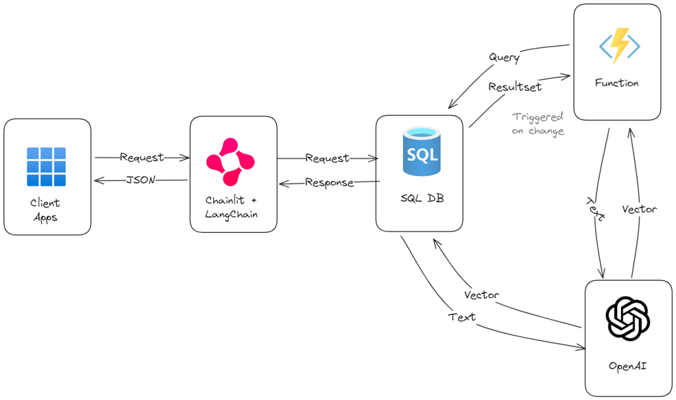

# Azure SQL DB, Langchain and Chainlit

Sample RAG pattern using Azure SQL DB, Langchain and Chainlit as demonstrated in the [#RAGHack](https://github.com/microsoft/RAG_Hack) conference. Full details and video recording available here: [RAG on Azure SQL Server](https://github.com/microsoft/RAG_Hack/discussions/53).

## Architecture



## Solution

The solution works locally and in Azure. The solution is composed of three main Azure components:

- [Azure SQL Database](https://learn.microsoft.com/en-us/azure/azure-sql/database/sql-database-paas-overview?view=azuresql): The database that stores the data.
- [Azure Open AI](https://learn.microsoft.com/azure/ai-services/openai/): The language model that generates the text and the embeddings.
- [Azure Functions](https://learn.microsoft.com/azure/azure-functions/functions-overview?pivots=programming-language-csharp): The serverless function to automate the process of generating the embeddings (this is optional for this sample)


### Azure Open AI

Make sure to have two models deployed, one for generating embeddings (*text-embedding-3-small* model recommended) and one for handling the chat (*gpt-4 turbo* recommended). You can use the Azure OpenAI service to deploy the models. Make sure to have the endpoint and the API key ready. The two models are assumed to be deployed with the following names:

- Embedding model: `text-embedding-3-small`
- Chat model: `gpt-4`


### Database

> [!NOTE]  
> Vector Functions are in Early Adopter Preview. Get access to the preview via https://aka.ms/azuresql-vector-eap-announcement

To deploy the database, you can either the provided .NET 8 Core console application or do it manually.

To use .NET 8 Core console application move into the `/database` and then make sure to create a `.env` file in the `/database` folder starting from the `.env.example` file:

- `MSSQL`: the connection string to the Azure SQL database where you want to deploy the database objects and sample data
- `OPENAI_URL`: specify the URL of your Azure OpenAI endpoint, eg: 'https://my-open-ai.openai.azure.com/'
- `OPENAI_KEY`: specify the API key of your Azure OpenAI endpoint
- `OPENAI_MODEL`: specify the deployment name of your Azure OpenAI embedding endpoint, eg: 'text-embedding-3-small'

If you want to deploy the database manually, make sure to execute the script in the `/database/sql` folder in the order specifed by the number in the file name. Some files (`020-security.sql` and `060-get_embedding.sql`) with have placeholders that you have to replace with your own values:

- `$OPENAI_URL$`: replace with the URL of your Azure OpenAI endpoint, eg: 'https://my-open-ai.openai.azure.com/'
- `$OPENAI_KEY$`: replace with the API key of your Azure OpenAI endpoint
- `$OPENAI_MODEL$`: replace with the deployment name of your Azure OpenAI embedding endpoint, eg: 'text-embedding-3-small'

### Chainlit

Chainlit solution is in `chainlit` folder. Move into the folder, create a virtual environment and install the requirements:

```bash
python -m venv .venv
source .venv/bin/activate
pip install -r requirements.txt
```

or, on Windows: 

```PowerShell
python -m venv .venv
.venv/Script/activate
pip install -r requirements.txt
```

Then make sure to create a `.env` file in the `/chainlit` folder starting from the `.env.example` file and it with your own values, then run the chainlit solution:

```bash
chainlit run app.py
```

Once the application is running, you'll be able to ask question about your data and get the answer from the Azure OpenAI model. For example you can ask question on the data you have in the database:

```
Is there any session on Retrieval Augmented Generation?
```

You'll see that Langchain will call the function `get_similar_sessions` that behind the scenes connects to the database and excute the stored procedure `web.find_sessions` which perform vector search on database data.

The RAG process is defined using Langchain's LCEL (Langchain Expression Language)[https://python.langchain.com/v0.1/docs/expression_language/] that can be easily extended to include more complex logic, even including complex agent actions with the aid of [LangGraph](https://langchain-ai.github.io/langgraph/), where the function calling the stored procedure will be a [tool](https://langchain-ai.github.io/langgraph/how-tos/tool-calling/?h=tool) available to the agent.


### Azure Functions (optional)

TDB